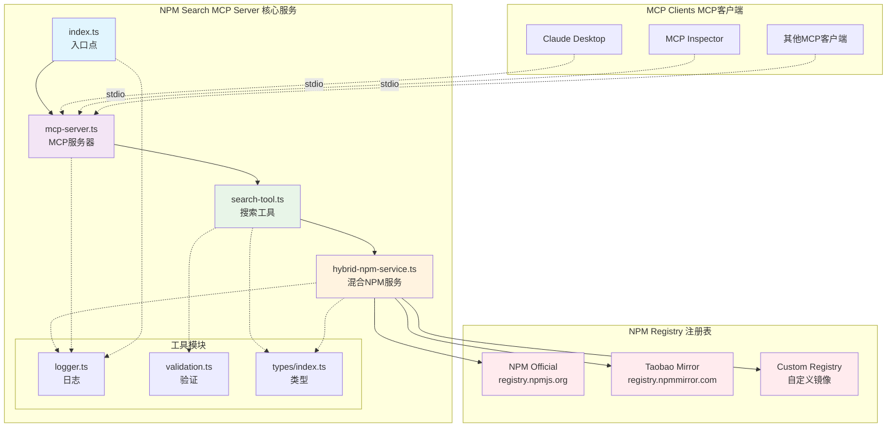
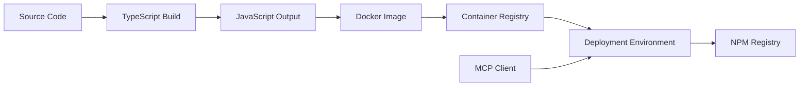

# longmo-npm-search-mcp-server 项目架构图

## 项目概览

longmo-npm-search-mcp-server 是一个基于 Model Context Protocol (MCP) 的服务器，用于搜索 npm 包。支持多种 NPM Registry 配置，具有模块化设计和完善的错误处理。

## 当前实现架构图



## 组件说明

### 核心组件

1. **MCP Server (index.ts)**
   - 主要入口点
   - 实现 MCP 协议
   - 处理客户端连接和请求

2. **NPM Search Tool**
   - 提供 npm 包搜索功能
   - 与 NPM Registry API 交互
   - 返回格式化的搜索结果

3. **NPM Registry API**
   - 连接到 npmjs.com 官方注册表
   - 执行包搜索查询
   - 获取包的详细信息

### 技术栈

- **运行时**: Node.js
- **语言**: TypeScript
- **协议**: Model Context Protocol (MCP)
- **依赖管理**: npm
- **构建工具**: TypeScript Compiler
- **容器化**: Docker

### 项目结构

```
npm-search-mcp-server/
├── index.ts              # 主要服务器实现
├── package.json          # 项目配置和依赖
├── tsconfig.json         # TypeScript 配置
├── tsconfig.base.json    # 基础 TypeScript 配置
├── Dockerfile            # Docker 容器配置
├── smithery.yaml         # Smithery 配置
├── README.md             # 项目文档
├── LICENSE               # 许可证
├── logo.png              # 项目标志
├── screenshot.png        # 项目截图
└── docs/                 # 文档目录
    └── architecture.md   # 架构文档
```

## 数据流

1. **客户端请求**: MCP 客户端发送搜索请求到服务器
2. **请求处理**: 服务器解析请求并验证参数
3. **API 调用**: 服务器调用 NPM Registry API 进行搜索
4. **数据处理**: 处理和格式化从 NPM 返回的数据
5. **响应返回**: 将格式化的结果返回给客户端

## 部署架构



## 扩展性考虑

- **缓存机制**: 可以添加 Redis 缓存来提高搜索性能
- **负载均衡**: 支持多实例部署
- **监控**: 集成日志和监控系统
- **安全性**: 实现 API 限流和认证机制

## 配置管理

- 环境变量配置
- Docker 容器配置
- TypeScript 编译配置
- MCP 协议配置