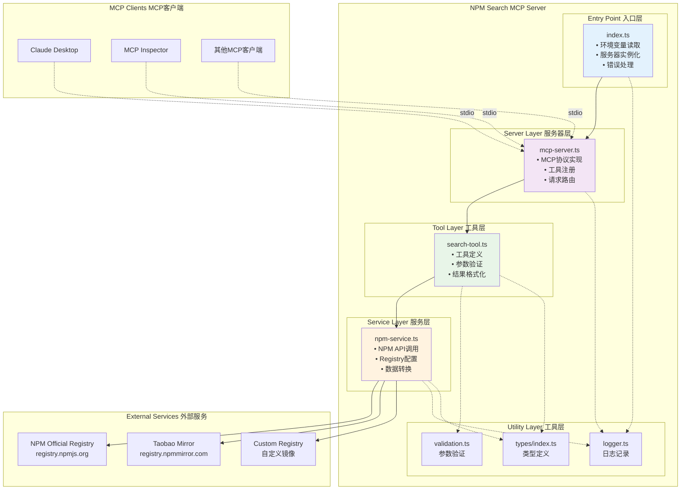
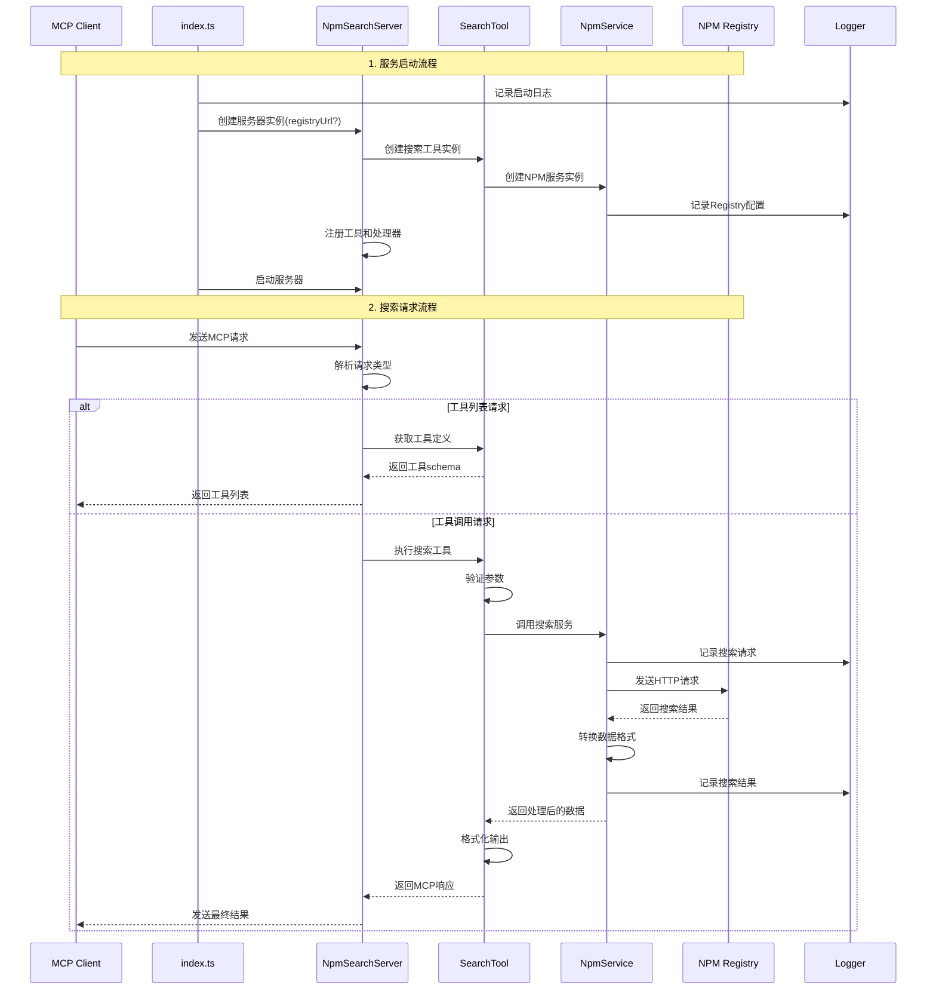
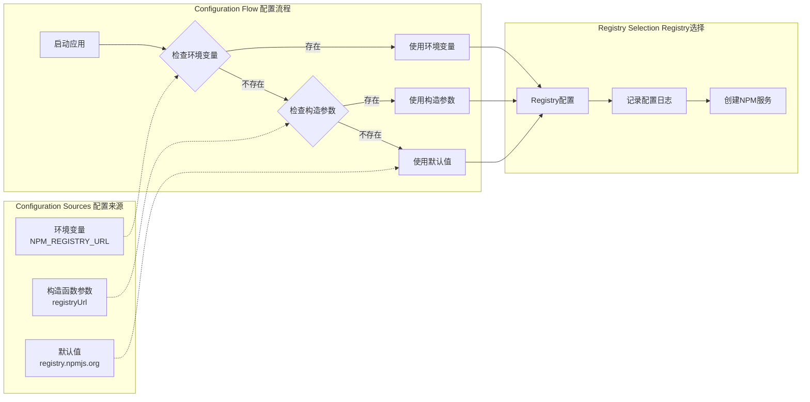

# NPM Search MCP Server 当前架构图

## 重构前后对比

### 重构前架构 (根目录 index.ts) - 使用npm CLI
原始实现通过执行 `npm search` 命令行工具进行查询，继承用户的npm配置，无需额外配置Registry。


### 重构后架构 (src/ 模块化) - 直接HTTP API
现在的实现直接调用NPM Registry HTTP API，需要配置Registry地址，但提供更好的性能和数据结构化。


## 实际项目架构

基于当前代码实现的真实架构图，展示项目的实际结构和数据流。

### 核心架构图



### 实际数据流



### 配置流程图



### 文件结构映射

```
src/
├── index.ts                    # 应用入口
│   ├── 读取环境变量 NPM_REGISTRY_URL
│   ├── 创建 NpmSearchServer 实例
│   ├── 启动服务器
│   └── 错误处理和退出
│
├── server/
│   └── mcp-server.ts          # MCP服务器实现
│       ├── 实现MCP协议
│       ├── 注册搜索工具
│       ├── 处理 ListTools 请求
│       ├── 处理 CallTool 请求
│       └── 管理stdio传输
│
├── tools/
│   └── search-tool.ts         # 搜索工具实现
│       ├── 定义工具schema
│       ├── 参数验证
│       ├── 调用NPM服务
│       └── 格式化响应
│
├── services/
│   └── hybrid-npm-service.ts  # 混合NPM服务实现
│       ├── Registry URL配置
│       ├── HTTP请求处理
│       ├── 搜索参数构建
│       ├── 响应数据转换
│       └── 错误处理
│
├── utils/
│   ├── logger.ts              # 日志工具
│   │   ├── 统一日志格式
│   │   ├── 不同级别日志
│   │   └── 错误日志记录
│   │
│   └── validation.ts          # 验证工具
│       ├── 搜索查询验证
│       ├── 搜索选项验证
│       └── 参数类型检查
│
└── types/
    └── index.ts               # 类型定义
        ├── NpmPackage 接口
        ├── SearchOptions 接口
        ├── SearchResult 接口
        └── 其他类型定义
```

### 实际运行模式

#### 开发模式
```bash
# 监听文件变化，自动重新编译
npm run dev
# 或
npm run watch
```

#### 调试模式
```bash
# 使用MCP Inspector调试
npm run debug

# 直接stdio调试
npm run debug:stdio

# 测试MCP协议
npm run test:mcp
```

#### 生产模式
```bash
# 构建项目
npm run build

# 运行编译后的代码
node dist/src/index.js
```

### 环境变量支持

| 变量名 | 描述 | 默认值 | 示例 |
|--------|------|--------|------|
| `NPM_REGISTRY_URL` | NPM Registry地址 | `https://registry.npmjs.org` | `https://registry.npmmirror.com` |
| `NODE_ENV` | 运行环境 | - | `production` |
| `LOG_LEVEL` | 日志级别 | `info` | `debug` |

### Registry配置示例

```bash
# 使用官方NPM Registry (默认)
node dist/src/index.js

# 使用淘宝镜像
NPM_REGISTRY_URL="https://registry.npmmirror.com" node dist/src/index.js

# 使用腾讯镜像
NPM_REGISTRY_URL="https://mirrors.cloud.tencent.com/npm" node dist/src/index.js

# 使用华为镜像
NPM_REGISTRY_URL="https://mirrors.huaweicloud.com/repository/npm" node dist/src/index.js
```

### 工具定义

当前实现的工具：

```json
{
  "name": "search_npm_packages",
  "description": "Search for npm packages",
  "inputSchema": {
    "type": "object",
    "properties": {
      "query": {
        "type": "string",
        "description": "Search query"
      }
    },
    "required": ["query"]
  }
}
```

### 响应格式

```json
{
  "content": [
    {
      "type": "text",
      "text": "{\n  \"packages\": [...],\n  \"total\": 1234,\n  \"time\": \"2024-01-01T00:00:00.000Z\"\n}"
    }
  ]
}
```

### 错误处理

```json
{
  "content": [
    {
      "type": "text",
      "text": "Error: Invalid search query"
    }
  ],
  "isError": true
}
```

## 重构前后对比

### 配置方式对比

| 方面 | 重构前 (根目录index.ts) | 重构后 (src/模块化) |
|------|---------------------|-------------------|
| **配置方式** | 硬编码Registry地址 | 环境变量 + 构造参数 |
| **文件结构** | 单文件实现 | 模块化多文件 |
| **Registry支持** | 固定官方Registry | 支持多种Registry |
| **启动方式** | 直接运行，无需配置 | 需要配置或使用默认值 |
| **扩展性** | 有限 | 高度可扩展 |
| **维护性** | 简单但难扩展 | 复杂但易维护 |

### 使用方式对比

#### 重构前 (简单方式)
```bash
# 直接运行，无需任何配置
node index.js
```

#### 重构后 (配置方式)
```bash
# 使用默认Registry (兼容原来的方式)
node dist/src/index.js

# 使用自定义Registry
NPM_REGISTRY_URL="https://registry.npmmirror.com" node dist/src/index.js
```

## 与理论架构的对比

### 当前实现 vs 理论设计

| 方面 | 当前实现 | 理论设计 |
|------|----------|----------|
| **传输方式** | stdio only | stdio/HTTP/WebSocket |
| **工具数量** | 1个搜索工具 | 多个工具支持 |
| **缓存机制** | 无缓存 | Redis/内存缓存 |
| **负载均衡** | 单实例 | 多实例负载均衡 |
| **监控** | 基础日志 | 完整监控体系 |
| **配置** | 环境变量 | 配置文件+环境变量 |

### 扩展建议

#### 1. 支持原始方式的零配置启动
```typescript
// 自动检测最佳Registry
class RegistryDetector {
  static async detectBestRegistry(): Promise<string> {
    // 测试多个Registry的连接速度，选择最快的
    const registries = [
      'https://registry.npmjs.org',
      'https://registry.npmmirror.com'
    ];
    // 实现连接测试逻辑
  }
}
```

#### 2. 向后兼容模式
```typescript
// 在npm-service.ts中添加兼容模式
constructor(registryUrl?: string) {
  // 如果没有配置，使用默认值，保持原来的简单性
  this.baseUrl = registryUrl || 
                 process.env.NPM_REGISTRY_URL || 
                 'https://registry.npmjs.org/-/v1/search';
  
  // 只在使用自定义配置时记录日志
  if (registryUrl || process.env.NPM_REGISTRY_URL) {
    logger.info(`Using custom NPM registry: ${this.baseUrl}`);
  }
}
```

#### 3. 简化启动脚本
```json
{
  "scripts": {
    "start": "node dist/src/index.js",
    "start:simple": "node dist/src/index.js",
    "start:taobao": "NPM_REGISTRY_URL=https://registry.npmmirror.com node dist/src/index.js"
  }
}
```

#### 4. 配置检查工具
```bash
# 检查当前配置状态
npm run check-config
```

这个架构图反映了项目重构前后的变化，帮助理解从简单实现到模块化架构的演进过程。重构后虽然增加了配置复杂性，但通过合理的默认值设计，仍可保持原有的简单使用方式。