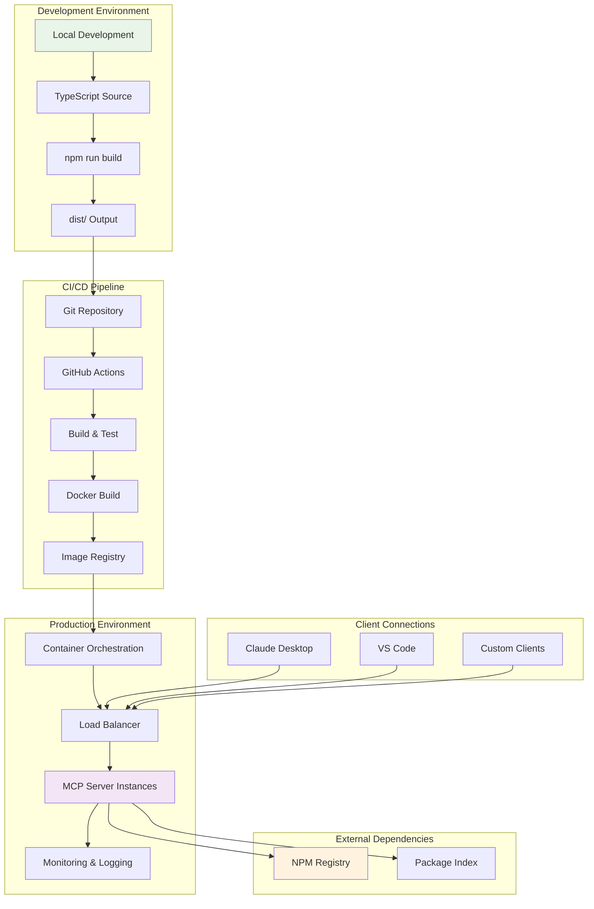
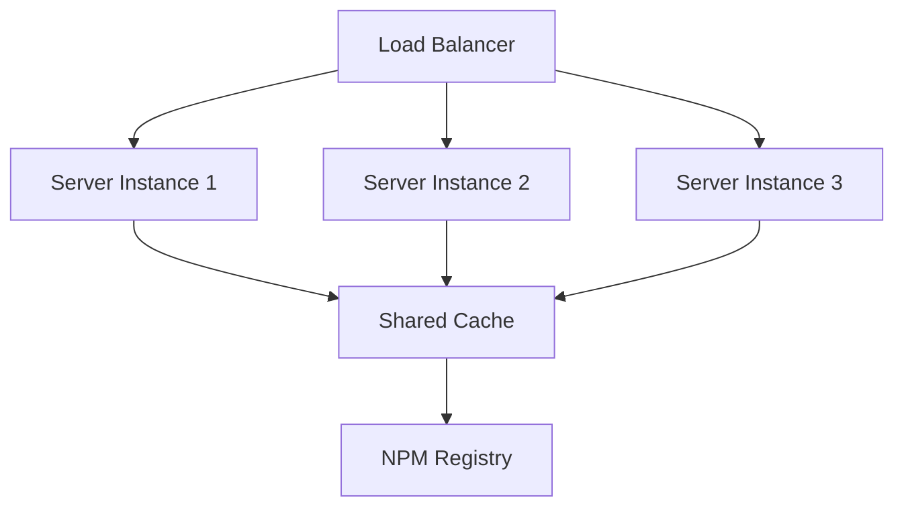

# NPM Search MCP Server 部署架构

## 部署架构概览



## 部署选项

### 1. 本地部署 (Local Deployment)

#### 直接运行
```bash
# 安装依赖
npm install

# 构建项目
npm run build

# 运行服务器
node dist/index.js
```

#### Docker 容器
```bash
# 构建镜像
docker build -t npm-search-mcp-server .

# 运行容器
docker run -p 3000:3000 npm-search-mcp-server
```

### 2. 云平台部署

#### Docker Compose 部署
```yaml
version: '3.8'
services:
  npm-search-mcp:
    build: .
    ports:
      - "3000:3000"
    environment:
      - NODE_ENV=production
      - LOG_LEVEL=info
    restart: unless-stopped
    healthcheck:
      test: ["CMD", "curl", "-f", "http://localhost:3000/health"]
      interval: 30s
      timeout: 10s
      retries: 3
```

#### Kubernetes 部署
```yaml
apiVersion: apps/v1
kind: Deployment
metadata:
  name: npm-search-mcp-server
spec:
  replicas: 3
  selector:
    matchLabels:
      app: npm-search-mcp-server
  template:
    metadata:
      labels:
        app: npm-search-mcp-server
    spec:
      containers:
      - name: server
        image: npm-search-mcp-server:latest
        ports:
        - containerPort: 3000
        env:
        - name: NODE_ENV
          value: "production"
        resources:
          requests:
            memory: "128Mi"
            cpu: "100m"
          limits:
            memory: "256Mi"
            cpu: "200m"
```

### 3. 无服务器部署 (Serverless)

#### AWS Lambda
```typescript
// lambda-handler.ts
import { APIGatewayProxyHandler } from 'aws-lambda'
import { createMCPServer } from './index'

export const handler: APIGatewayProxyHandler = async (event, context) => {
  const server = createMCPServer()
  // 处理 MCP 请求
  return {
    statusCode: 200,
    body: JSON.stringify(response)
  }
}
```

#### Vercel 部署
```json
{
  "functions": {
    "api/mcp.ts": {
      "runtime": "nodejs18.x"
    }
  },
  "rewrites": [
    {
      "source": "/mcp/(.*)",
      "destination": "/api/mcp"
    }
  ]
}
```

## 环境配置

### 开发环境
```bash
# .env.development
NODE_ENV=development
LOG_LEVEL=debug
NPM_REGISTRY_URL=https://registry.npmjs.org
CACHE_TTL=300
REQUEST_TIMEOUT=5000
```

### 生产环境
```bash
# .env.production
NODE_ENV=production
LOG_LEVEL=info
NPM_REGISTRY_URL=https://registry.npmjs.org
CACHE_TTL=3600
REQUEST_TIMEOUT=10000
MAX_CONCURRENT_REQUESTS=100
```

## 监控和日志

### 健康检查端点
```typescript
app.get('/health', (req, res) => {
  res.json({
    status: 'healthy',
    timestamp: new Date().toISOString(),
    version: process.env.npm_package_version,
    uptime: process.uptime()
  })
})
```

### 指标收集
```typescript
// Prometheus 指标
const promClient = require('prom-client')

const httpRequestDuration = new promClient.Histogram({
  name: 'http_request_duration_seconds',
  help: 'Duration of HTTP requests in seconds',
  labelNames: ['method', 'route', 'status']
})

const npmApiCalls = new promClient.Counter({
  name: 'npm_api_calls_total',
  help: 'Total number of NPM API calls',
  labelNames: ['endpoint', 'status']
})
```

### 日志配置
```typescript
import winston from 'winston'

const logger = winston.createLogger({
  level: process.env.LOG_LEVEL || 'info',
  format: winston.format.combine(
    winston.format.timestamp(),
    winston.format.errors({ stack: true }),
    winston.format.json()
  ),
  transports: [
    new winston.transports.Console(),
    new winston.transports.File({ filename: 'error.log', level: 'error' }),
    new winston.transports.File({ filename: 'combined.log' })
  ]
})
```

## 扩展性考虑

### 水平扩展


### 缓存策略
- **内存缓存**: 单实例快速访问
- **Redis 缓存**: 多实例共享缓存
- **CDN 缓存**: 静态资源缓存

### 负载均衡
- **轮询**: 简单的请求分发
- **最少连接**: 基于连接数的分发
- **加权轮询**: 基于服务器性能的分发

## 安全配置

### HTTPS 配置
```nginx
server {
    listen 443 ssl http2;
    server_name mcp-server.example.com;
    
    ssl_certificate /path/to/cert.pem;
    ssl_certificate_key /path/to/key.pem;
    
    location / {
        proxy_pass http://localhost:3000;
        proxy_set_header Host $host;
        proxy_set_header X-Real-IP $remote_addr;
    }
}
```

### 防火墙规则
```bash
# 只允许必要的端口
ufw allow 22/tcp    # SSH
ufw allow 80/tcp    # HTTP
ufw allow 443/tcp   # HTTPS
ufw deny 3000/tcp   # 直接访问应用端口
```

### 访问控制
```typescript
// API 限流
const rateLimit = require('express-rate-limit')

const limiter = rateLimit({
  windowMs: 15 * 60 * 1000, // 15 分钟
  max: 100, // 最多 100 个请求
  message: 'Too many requests from this IP'
})

app.use('/api/', limiter)
```

## 备份和恢复

### 配置备份
```bash
#!/bin/bash
# backup-config.sh
tar -czf config-backup-$(date +%Y%m%d).tar.gz \
  .env \
  docker-compose.yml \
  nginx.conf
```

### 数据备份
```bash
#!/bin/bash
# backup-data.sh
docker exec redis redis-cli BGSAVE
cp /var/lib/redis/dump.rdb backup/redis-$(date +%Y%m%d).rdb
```

### 灾难恢复
1. **服务器故障**: 自动故障转移到备用实例
2. **数据丢失**: 从备份恢复缓存数据
3. **网络中断**: 降级到本地缓存模式