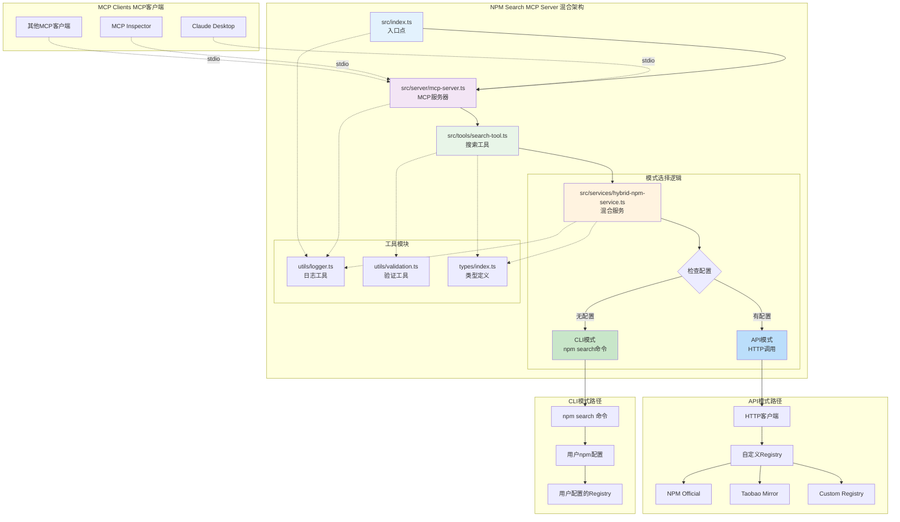
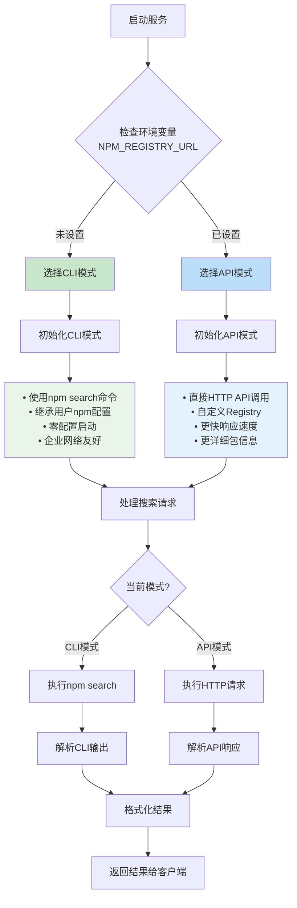

# NPM Search MCP Server 最终混合架构

## 混合模式架构图



## 决策流程图



## 实现对比

### 原始实现 vs 重构实现 vs 混合实现

| 特性 | 原始实现 | 重构实现 | 混合实现 |
|------|----------|----------|----------|
| **文件结构** | 单文件 | 模块化 | 模块化 |
| **配置方式** | 硬编码 | 环境变量必需 | 环境变量可选 |
| **默认行为** | npm search | 需要配置 | npm search |
| **Registry支持** | 继承npm配置 | 自定义Registry | 两者都支持 |
| **启动复杂度** | 零配置 | 需要配置 | 零配置 |
| **功能丰富度** | 基础 | 丰富 | 自适应 |
| **向后兼容** | N/A | 不兼容 | 完全兼容 |

### 使用场景对比

#### 个人开发者
```bash
# 原始方式 - 简单直接
node index.js

# 混合方式 - 保持一致
node dist/src/index.js
```

#### 企业环境
```bash
# 原始方式 - 继承企业npm配置
node index.js

# 混合方式 - 同样继承企业npm配置
node dist/src/index.js
```

#### 需要自定义Registry
```bash
# 原始方式 - 不支持
# 需要修改代码

# 混合方式 - 支持
NPM_REGISTRY_URL="https://registry.npmmirror.com" node dist/src/index.js
```

## 响应格式对比

### CLI模式响应
```json
{
  "packages": [
    {
      "name": "react",
      "version": "18.2.0",
      "description": "React is a JavaScript library for building user interfaces",
      "keywords": ["react", "ui", "framework"],
      "author": "React Team",
      "downloads": {
        "weekly": null,
        "monthly": null
      },
      "score": null
    }
  ],
  "total": 15,
  "time": "2024-01-01T00:00:00.000Z",
  "mode": "cli",
  "registry": "CLI mode - uses npm configuration"
}
```

### API模式响应
```json
{
  "packages": [
    {
      "name": "react",
      "version": "18.2.0",
      "description": "React is a JavaScript library for building user interfaces",
      "keywords": ["react", "ui", "framework"],
      "author": {
        "name": "React Team",
        "email": "react@fb.com"
      },
      "downloads": {
        "weekly": 18500000,
        "monthly": 75000000
      },
      "score": {
        "final": 0.95,
        "detail": {
          "quality": 0.98,
          "popularity": 0.95,
          "maintenance": 0.92
        }
      }
    }
  ],
  "total": 429016,
  "time": "2024-01-01T00:00:00.000Z",
  "mode": "api",
  "registry": "API mode - https://registry.npmjs.org/-/v1/search"
}
```

## 配置检查工具

### 使用方式
```bash
# 检查当前配置和模式
npm run check-hybrid

# 检查原有配置（兼容）
npm run check-config
```

### 输出示例

#### CLI模式输出
```
=== NPM Search MCP Server 配置检查 ===

1. 运行模式:
   当前模式: CLI模式 (使用 npm search 命令)
   配置来源: 继承用户npm配置
   特点: 零配置启动，与重构前行为一致

2. 环境变量配置:
   NPM_REGISTRY_URL = (未设置)
   将使用CLI模式，继承npm配置

3. 模式测试:
   测试方式: npm search 命令
   正在测试 npm search 命令...
   ✅ CLI模式测试成功
   📦 找到 15 个包
```

#### API模式输出
```
=== NPM Search MCP Server 配置检查 ===

1. 运行模式:
   当前模式: API模式 (直接调用Registry API)
   Registry URL: https://registry.npmjs.org/-/v1/search
   配置来源: 环境变量 NPM_REGISTRY_URL
   特点: 自定义Registry，更快响应，更多功能

2. 环境变量配置:
   NPM_REGISTRY_URL = https://registry.npmjs.org

3. 模式测试:
   测试方式: HTTP API调用
   测试URL: https://registry.npmjs.org/-/v1/search?text=react&size=1
   ✅ API模式测试成功
   📦 找到 429016 个包
```

## 部署建议

### 开发环境
```bash
# 使用CLI模式，简单快速
npm run dev
```

### 测试环境
```bash
# 使用API模式，确保一致性
NPM_REGISTRY_URL="https://registry.npmjs.org" npm start
```

### 生产环境
```bash
# 根据需求选择模式
# CLI模式 - 继承系统npm配置
npm start

# API模式 - 明确指定Registry
NPM_REGISTRY_URL="https://registry.npmmirror.com" npm start
```

## 总结

混合模式架构实现了最佳的兼容性和灵活性：

### ✅ 向后兼容
- 默认行为与重构前完全一致
- 零配置启动
- 继承用户npm配置

### ✅ 功能增强
- 支持自定义Registry
- 更详细的包信息
- 更快的响应速度

### ✅ 灵活配置
- 环境变量可选配置
- 自动模式选择
- 运行时模式检测

### ✅ 企业友好
- 支持企业内网npm配置
- 支持代理和认证
- 支持自定义镜像

这种设计确保了用户可以无缝从原始版本迁移到新版本，同时获得新功能的好处。