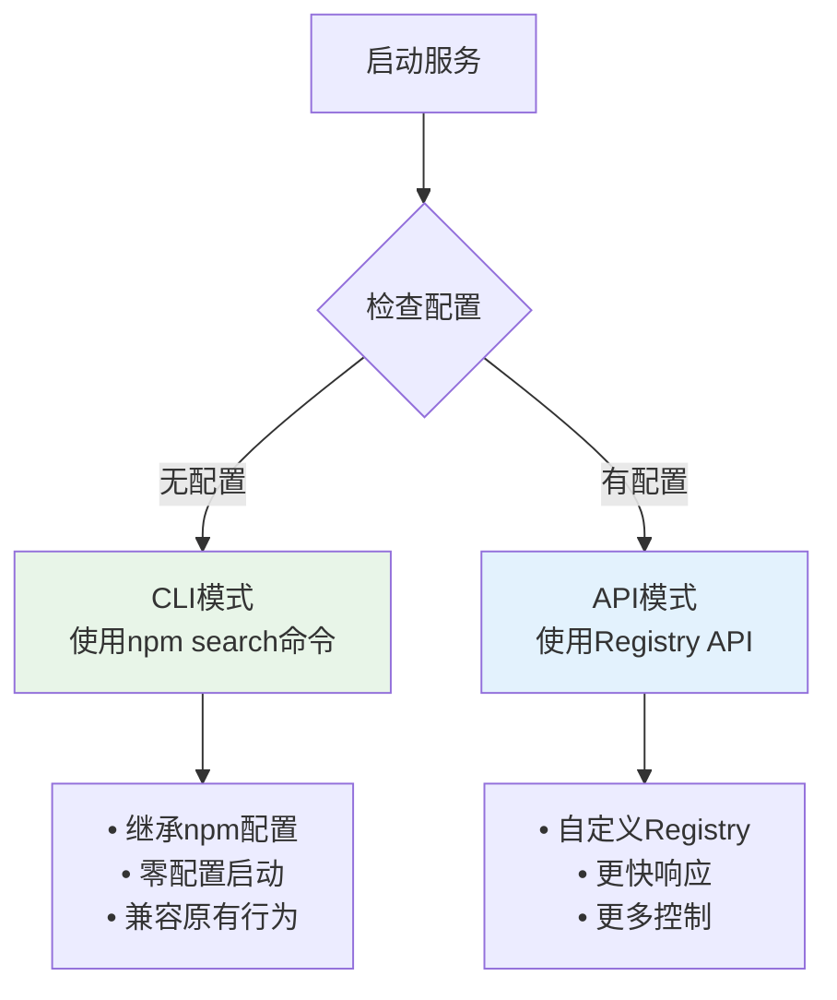
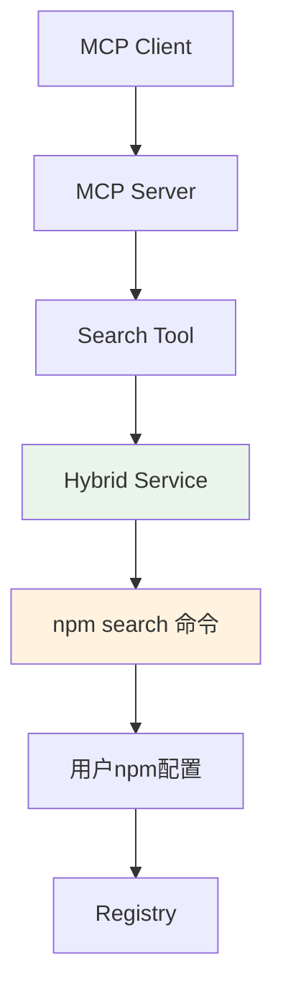
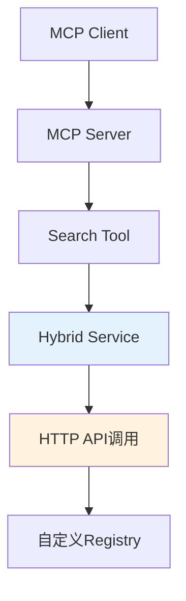

# NPM Search MCP Server 混合模式

## 混合模式概述

为了保持向后兼容性并提供新的灵活性，NPM Search MCP Server 现在支持混合模式：

- **CLI模式**: 使用 `npm search` 命令（默认，与重构前一致）
- **API模式**: 直接调用 NPM Registry API（新功能）

## 模式选择逻辑



## 使用方式

### 1. CLI模式（默认，与重构前一致）

```bash
# 直接启动，无需任何配置
node dist/src/index.js

# 或者
npm start
```

**特点**:
- ✅ 零配置启动
- ✅ 自动继承用户的npm配置（registry、proxy等）
- ✅ 与重构前行为完全一致
- ✅ 支持企业内网npm配置

### 2. API模式（新功能）

```bash
# 使用环境变量指定Registry
NPM_REGISTRY_URL="https://registry.npmmirror.com" node dist/src/index.js

# 使用淘宝镜像
NPM_REGISTRY_URL="https://registry.npmmirror.com" npm start

# 使用腾讯镜像
NPM_REGISTRY_URL="https://mirrors.cloud.tencent.com/npm" npm start
```

**特点**:
- ✅ 支持自定义Registry
- ✅ 更快的响应速度
- ✅ 更详细的包信息
- ✅ 支持分页和高级搜索选项

## 配置检查

```bash
# 检查当前模式和配置
npm run check-config
```

输出示例：

### CLI模式输出
```
=== NPM Search MCP Server 配置检查 ===

当前模式: CLI模式
使用工具: npm search 命令
配置来源: 继承用户npm配置

npm配置信息:
  registry = https://registry.npmjs.org/
  proxy = (未设置)
  
模式特点:
  ✅ 零配置启动
  ✅ 继承npm配置
  ✅ 支持企业内网配置
```

### API模式输出
```
=== NPM Search MCP Server 配置检查 ===

当前模式: API模式
Registry URL: https://registry.npmmirror.com/-/v1/search
配置来源: 环境变量 NPM_REGISTRY_URL

模式特点:
  ✅ 自定义Registry
  ✅ 更快响应速度
  ✅ 更详细包信息
```

## 架构对比

### CLI模式架构


### API模式架构


## 响应格式差异

### CLI模式响应
```json
{
  "packages": [
    {
      "name": "react",
      "version": "18.2.0",
      "description": "React is a JavaScript library...",
      "keywords": ["react", "ui"],
      "downloads": {
        "weekly": null,
        "monthly": null
      }
    }
  ],
  "total": 10,
  "time": "2024-01-01T00:00:00.000Z",
  "mode": "cli",
  "registry": "CLI mode - uses npm configuration"
}
```

### API模式响应
```json
{
  "packages": [
    {
      "name": "react",
      "version": "18.2.0",
      "description": "React is a JavaScript library...",
      "keywords": ["react", "ui"],
      "downloads": {
        "weekly": 18500000,
        "monthly": 75000000
      },
      "score": {
        "final": 0.95,
        "detail": {
          "quality": 0.98,
          "popularity": 0.95,
          "maintenance": 0.92
        }
      }
    }
  ],
  "total": 429016,
  "time": "2024-01-01T00:00:00.000Z",
  "mode": "api",
  "registry": "API mode - https://registry.npmmirror.com/-/v1/search"
}
```

## 性能对比

| 特性 | CLI模式 | API模式 |
|------|---------|---------|
| **启动速度** | 快 | 快 |
| **搜索速度** | 中等（命令行开销） | 快（直接HTTP） |
| **内存使用** | 低 | 低 |
| **网络请求** | 通过npm CLI | 直接HTTP |
| **配置复杂度** | 零配置 | 需要配置Registry |
| **企业网络支持** | 优秀（继承npm配置） | 需要手动配置 |

## 最佳实践

### 个人开发者
```bash
# 推荐使用CLI模式，零配置启动
node dist/src/index.js
```

### 企业环境
```bash
# 如果企业有npm配置，使用CLI模式
node dist/src/index.js

# 如果需要特定Registry，使用API模式
NPM_REGISTRY_URL="https://npm.company.com" node dist/src/index.js
```

### CI/CD环境
```bash
# 使用API模式，明确指定Registry
NPM_REGISTRY_URL="https://registry.npmmirror.com" node dist/src/index.js
```

## 故障排除

### CLI模式问题
```bash
# 检查npm配置
npm config list

# 测试npm search命令
npm search react

# 检查网络连接
npm ping
```

### API模式问题
```bash
# 测试Registry连接
curl "https://registry.npmjs.org/-/v1/search?text=react&size=1"

# 检查环境变量
echo $NPM_REGISTRY_URL

# 使用配置检查工具
npm run check-config
```

## 迁移指南

### 从原始版本迁移
原始版本用户无需任何更改，新版本默认使用CLI模式，行为完全一致。

### 启用新功能
如需使用API模式的新功能（如下载统计、评分等），设置环境变量：
```bash
export NPM_REGISTRY_URL="https://registry.npmjs.org"
```

## 总结

混合模式设计实现了最佳的向后兼容性：
- **默认行为不变**: 与重构前完全一致
- **新功能可选**: 通过配置启用API模式
- **灵活配置**: 支持多种Registry选择
- **企业友好**: 继承现有npm配置