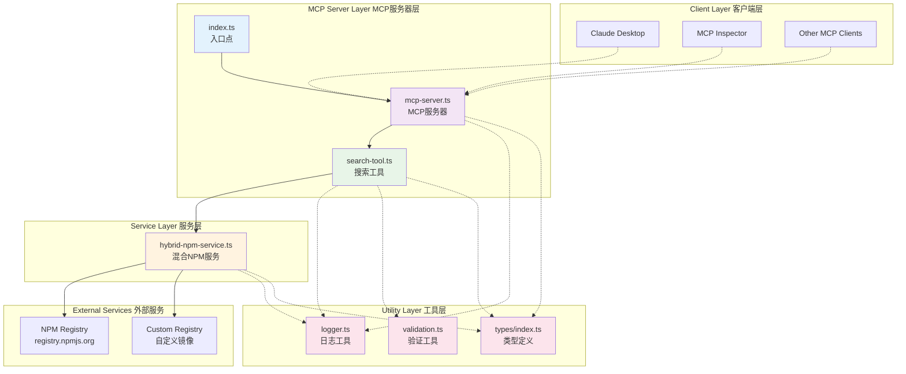
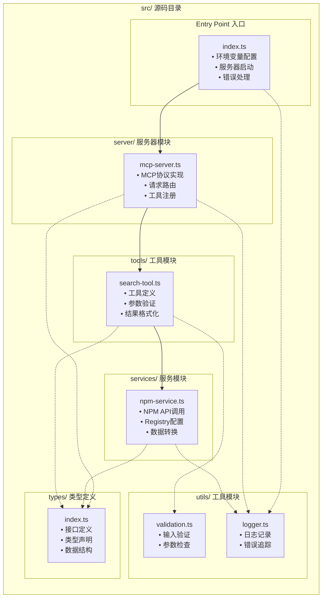
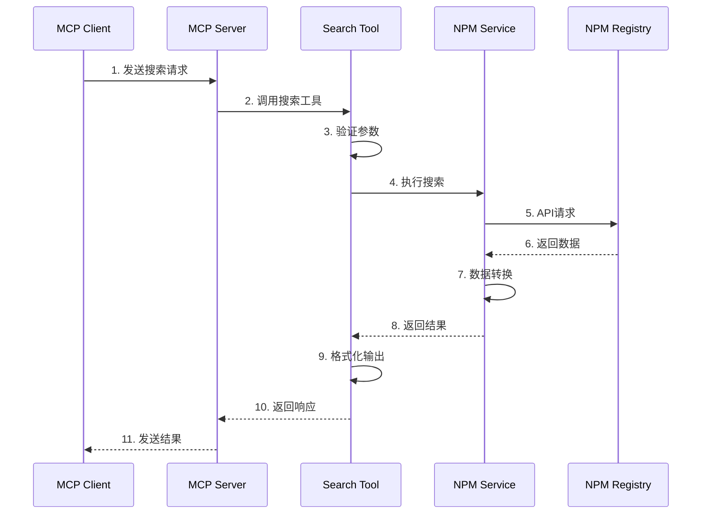
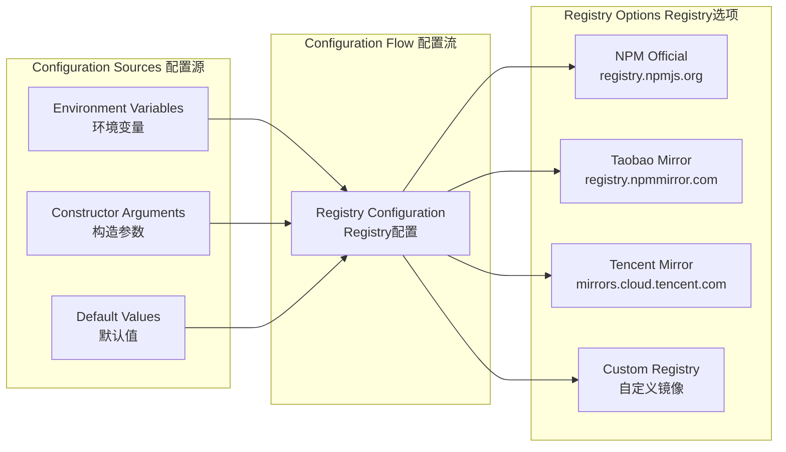

# NPM Search MCP Server 项目架构图

## 项目概览

longmo-npm-search-mcp-server 是一个基于 Model Context Protocol (MCP) 的服务器，提供 NPM 包搜索功能。支持自定义 NPM registry 配置，具有良好的模块化设计和错误处理机制。

## 整体架构图



## 详细模块架构



## 数据流架构



## 配置架构



## 项目结构

```
npm-search-mcp-server/
├── src/                          # 源码目录
│   ├── index.ts                  # 应用入口点
│   ├── server/                   # 服务器模块
│   │   └── mcp-server.ts         # MCP服务器实现
│   ├── tools/                    # 工具模块
│   │   └── search-tool.ts        # NPM搜索工具
│   ├── services/                 # 服务模块
│   │   └── npm-service.ts        # NPM API服务
│   ├── utils/                    # 工具模块
│   │   ├── logger.ts             # 日志工具
│   │   └── validation.ts         # 验证工具
│   └── types/                    # 类型定义
│       └── index.ts              # 类型声明
├── docs/                         # 文档目录
│   ├── architecture.md           # 架构文档
│   ├── project-architecture.md   # 项目架构图
│   ├── api-reference.md          # API参考
│   ├── quick-start.md            # 快速开始
│   └── usage-guide.md            # 使用指南
├── scripts/                      # 脚本目录
│   └── check-config.js           # 配置检查脚本
├── dist/                         # 编译输出
├── package.json                  # 项目配置
├── tsconfig.json                 # TypeScript配置
├── Dockerfile                    # Docker配置
└── README.md                     # 项目说明
```

## 核心特性

### 1. 模块化设计
- **分层架构**: 清晰的分层结构，职责分离
- **依赖注入**: 支持配置注入，便于测试和扩展
- **接口抽象**: 良好的类型定义和接口设计

### 2. 配置灵活性
- **环境变量支持**: `NPM_REGISTRY_URL` 环境变量配置
- **多Registry支持**: 支持官方NPM、淘宝镜像、腾讯镜像等
- **运行时配置**: 支持启动时动态配置

### 3. 错误处理
- **统一日志**: 集中的日志管理
- **参数验证**: 输入参数的严格验证
- **异常捕获**: 完善的错误处理机制

### 4. 开发体验
- **TypeScript**: 完整的类型支持
- **热重载**: 开发模式下的自动重载
- **调试支持**: MCP Inspector集成

## 扩展点

### 1. 缓存机制
```typescript
// 可扩展的缓存接口
interface CacheService {
  get(key: string): Promise<any>;
  set(key: string, value: any, ttl?: number): Promise<void>;
}
```

### 2. 多工具支持
```typescript
// 工具注册机制
interface ToolRegistry {
  register(tool: Tool): void;
  getTools(): Tool[];
}
```

### 3. 中间件支持
```typescript
// 请求中间件
interface Middleware {
  handle(request: any, next: Function): Promise<any>;
}
```

## 部署架构

```mermaid
graph TB
    subgraph "Development 开发环境"
        DEV_SRC[Source Code] --> DEV_BUILD[npm run dev]
        DEV_BUILD --> DEV_SERVER[Local Server]
    end
    
    subgraph "Production 生产环境"
        PROD_SRC[Source Code] --> PROD_BUILD[npm run build]
        PROD_BUILD --> PROD_DIST[dist/]
        PROD_DIST --> DOCKER[Docker Image]
        DOCKER --> DEPLOY[Deployment]
    end
    
    subgraph "Testing 测试环境"
        TEST_SRC[Source Code] --> TEST_BUILD[npm test]
        TEST_BUILD --> TEST_COVERAGE[Coverage Report]
    end
```



## 性能考虑

1. **请求缓存**: 对频繁搜索的包进行缓存
2. **连接池**: NPM API请求的连接复用
3. **限流机制**: 防止API请求过于频繁
4. **数据压缩**: 大量数据的压缩传输

## 安全考虑

1. **输入验证**: 严格的参数验证和清理
2. **错误信息**: 避免敏感信息泄露
3. **依赖安全**: 定期更新依赖包
4. **网络安全**: HTTPS通信和证书验证