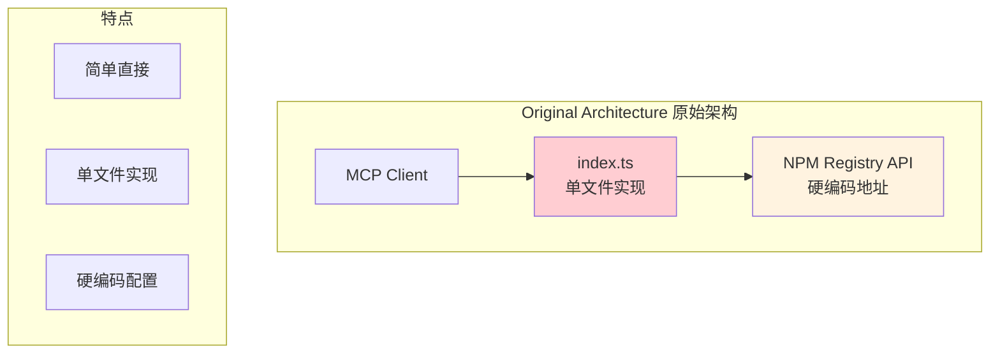
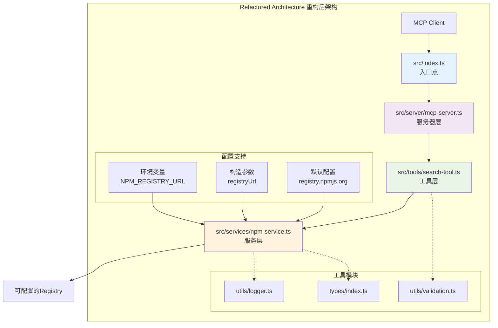

# NPM Search MCP Server 重构对比

## 重构前后架构对比

### 原始架构 (根目录 index.ts)



### 重构后架构 (src/ 目录结构)



## 详细对比分析

### 1. 文件结构对比

#### 重构前 (简单结构)
```
npm-search-mcp-server/
├── index.ts              # 所有逻辑在一个文件
├── package.json
├── tsconfig.json
└── README.md
```

#### 重构后 (模块化结构)
```
npm-search-mcp-server/
├── index.ts              # 旧版本文件 (保留)
├── src/                  # 新的源码目录
│   ├── index.ts          # 新的入口点
│   ├── server/           # 服务器模块
│   ├── tools/            # 工具模块
│   ├── services/         # 服务模块
│   ├── utils/            # 工具函数
│   └── types/            # 类型定义
├── docs/                 # 文档目录
├── scripts/              # 脚本目录
└── dist/                 # 编译输出
```

### 2. 配置方式对比

#### 重构前 - 硬编码配置
```typescript
// 原始 index.ts (推测)
const NPM_REGISTRY_URL = 'https://registry.npmjs.org/-/v1/search';

// 直接使用固定地址
async function searchPackages(query: string) {
  const response = await fetch(`${NPM_REGISTRY_URL}?text=${query}`);
  // ...
}
```

#### 重构后 - 可配置方式
```typescript
// src/index.ts
const registryUrl = process.env.NPM_REGISTRY_URL;
const server = new NpmSearchServer(registryUrl);

// src/services/npm-service.ts
constructor(registryUrl?: string) {
  const customRegistry = registryUrl || process.env.NPM_REGISTRY_URL;
  this.baseUrl = customRegistry 
    ? `${customRegistry.replace(/\/$/, '')}/-/v1/search`
    : 'https://registry.npmjs.org/-/v1/search';
}
```

### 3. 功能对比

| 特性 | 重构前 | 重构后 |
|------|--------|--------|
| **文件结构** | 单文件 | 模块化多文件 |
| **Registry配置** | 硬编码 | 环境变量 + 参数配置 |
| **错误处理** | 基础 | 完善的错误处理和日志 |
| **类型安全** | 基础 | 完整的TypeScript类型 |
| **可扩展性** | 有限 | 高度可扩展 |
| **测试友好** | 困难 | 易于单元测试 |
| **维护性** | 简单但难扩展 | 复杂但易维护 |

### 4. 代码复杂度对比

#### 重构前的优势
- ✅ **简单直接**: 所有逻辑在一个文件中
- ✅ **快速启动**: 无需复杂的模块导入
- ✅ **易于理解**: 代码流程一目了然
- ✅ **部署简单**: 单文件部署

#### 重构前的劣势
- ❌ **硬编码配置**: 无法灵活切换Registry
- ❌ **难以扩展**: 添加新功能需要修改主文件
- ❌ **测试困难**: 单体结构难以进行单元测试
- ❌ **维护困难**: 代码增长后难以维护

#### 重构后的优势
- ✅ **配置灵活**: 支持多种Registry配置方式
- ✅ **模块化**: 职责分离，易于维护
- ✅ **类型安全**: 完整的TypeScript支持
- ✅ **可扩展**: 易于添加新工具和功能
- ✅ **测试友好**: 每个模块可独立测试

#### 重构后的劣势
- ❌ **复杂度增加**: 需要理解多个文件的关系
- ❌ **配置依赖**: 需要正确配置Registry地址
- ❌ **学习成本**: 新开发者需要了解整体架构

## 迁移指南

### 从原始版本迁移到重构版本

#### 1. 保持兼容性
```bash
# 如果不设置环境变量，使用默认Registry
node dist/src/index.js

# 等同于原来的硬编码行为
NPM_REGISTRY_URL="https://registry.npmjs.org" node dist/src/index.js
```

#### 2. 利用新特性
```bash
# 使用淘宝镜像
NPM_REGISTRY_URL="https://registry.npmmirror.com" node dist/src/index.js

# 使用企业内网Registry
NPM_REGISTRY_URL="https://npm.company.com" node dist/src/index.js
```

#### 3. 配置检查
```bash
# 检查当前配置
npm run check-config
```

## 架构演进建议

### 支持原始方式的配置

为了支持"重构之前的方式"，可以考虑以下改进：

#### 1. 零配置启动
```typescript
// src/services/npm-service.ts
constructor(registryUrl?: string) {
  // 如果没有任何配置，直接使用官方Registry，无需用户配置
  this.baseUrl = registryUrl || 
                 process.env.NPM_REGISTRY_URL || 
                 'https://registry.npmjs.org/-/v1/search';
  
  // 只在非默认配置时记录日志
  if (registryUrl || process.env.NPM_REGISTRY_URL) {
    logger.info(`Using custom NPM registry: ${this.baseUrl}`);
  }
}
```

#### 2. 简化启动脚本
```json
{
  "scripts": {
    "start": "node dist/src/index.js",
    "start:simple": "node dist/src/index.js",
    "start:taobao": "NPM_REGISTRY_URL=https://registry.npmmirror.com node dist/src/index.js"
  }
}
```

#### 3. 向后兼容模式
```typescript
// 可以添加一个兼容模式，自动检测和使用最佳Registry
class RegistryDetector {
  static async detectBestRegistry(): Promise<string> {
    const registries = [
      'https://registry.npmjs.org',
      'https://registry.npmmirror.com',
      'https://mirrors.cloud.tencent.com/npm'
    ];
    
    // 测试连接速度，选择最快的
    // ...
  }
}
```

## 总结

重构后的架构虽然增加了配置的复杂性，但提供了更好的灵活性和可维护性。通过合理的默认配置和向后兼容设计，可以在保持原有简单性的同时，提供更强大的功能。

关键是要在**简单性**和**灵活性**之间找到平衡点，让用户既可以零配置快速启动（如原来的方式），也可以根据需要进行高级配置。