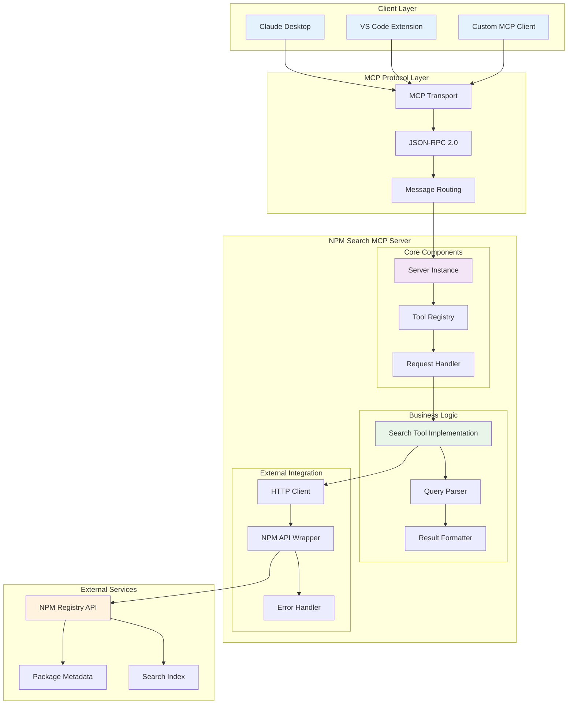
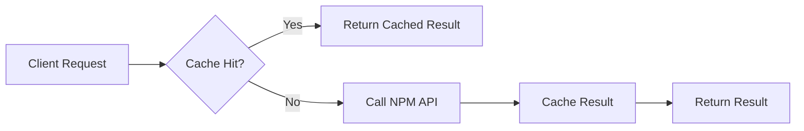

# NPM Search MCP Server 技术架构详解

## 系统架构图



## 组件详细说明

### 1. 客户端层 (Client Layer)

#### Claude Desktop
- Anthropic 的桌面应用
- 内置 MCP 客户端支持
- 通过 MCP 协议与服务器通信

#### VS Code Extension
- 支持 MCP 的 VS Code 扩展
- 开发环境集成
- 代码补全和搜索功能

#### Custom MCP Client
- 自定义应用程序
- 实现 MCP 客户端协议
- 特定业务需求集成

### 2. MCP 协议层 (MCP Protocol Layer)

#### MCP Transport
- 负责底层通信传输
- 支持 stdio、HTTP、WebSocket 等传输方式
- 连接管理和会话维护

#### JSON-RPC 2.0
- 基于 JSON-RPC 2.0 协议
- 标准化的请求/响应格式
- 错误处理和状态管理

#### Message Routing
- 消息路由和分发
- 请求验证和授权
- 协议版本协商

### 3. 服务器核心组件

#### Server Instance
```typescript
class NPMSearchServer {
  private tools: Map<string, Tool>
  private transport: Transport
  
  async handleRequest(request: MCPRequest): Promise<MCPResponse>
  async registerTool(tool: Tool): Promise<void>
}
```

#### Tool Registry
- 工具注册和管理
- 工具发现和枚举
- 权限控制和访问管理

#### Request Handler
- 请求解析和验证
- 参数提取和类型检查
- 响应格式化和返回

### 4. 业务逻辑层

#### Search Tool Implementation
```typescript
interface SearchTool {
  name: "search_npm_packages"
  description: "Search for npm packages"
  inputSchema: JSONSchema
  
  execute(params: SearchParams): Promise<SearchResult[]>
}
```

#### Query Parser
- 搜索查询解析
- 参数验证和标准化
- 搜索策略选择

#### Result Formatter
- 搜索结果格式化
- 数据清洗和过滤
- 响应结构标准化

### 5. 外部集成层

#### HTTP Client
- HTTP 请求管理
- 连接池和重试机制
- 超时和错误处理

#### NPM API Wrapper
```typescript
class NPMAPIClient {
  async searchPackages(query: string, options?: SearchOptions): Promise<Package[]>
  async getPackageInfo(name: string): Promise<PackageInfo>
  async getPackageVersions(name: string): Promise<Version[]>
}
```

#### Error Handler
- 统一错误处理
- 错误分类和映射
- 日志记录和监控

## 数据模型

### 搜索请求模型
```typescript
interface SearchRequest {
  query: string
  limit?: number
  offset?: number
  filters?: {
    author?: string
    keywords?: string[]
    license?: string
    updated?: DateRange
  }
}
```

### 搜索结果模型
```typescript
interface SearchResult {
  name: string
  version: string
  description: string
  author: Author
  keywords: string[]
  license: string
  repository?: Repository
  homepage?: string
  downloads: DownloadStats
  updatedAt: Date
  createdAt: Date
}
```

### 包信息模型
```typescript
interface PackageInfo {
  name: string
  versions: Record<string, VersionInfo>
  'dist-tags': Record<string, string>
  maintainers: Maintainer[]
  time: Record<string, Date>
  repository?: Repository
  bugs?: BugTracker
  readme?: string
}
```

## 性能优化策略

### 1. 缓存机制


### 2. 请求去重
- 相同查询请求合并
- 防止重复 API 调用
- 减少外部服务压力

### 3. 连接池管理
- HTTP 连接复用
- 连接数限制
- 超时和清理机制

## 错误处理策略

### 1. 错误分类
- **网络错误**: 连接超时、DNS 解析失败
- **API 错误**: 4xx/5xx HTTP 状态码
- **数据错误**: 响应格式不正确、数据验证失败
- **系统错误**: 内存不足、文件系统错误

### 2. 错误恢复
- 自动重试机制
- 降级服务策略
- 熔断器模式

### 3. 错误报告
- 结构化日志记录
- 错误指标收集
- 告警和通知机制

## 安全考虑

### 1. 输入验证
- 查询参数验证
- SQL 注入防护
- XSS 攻击防护

### 2. 访问控制
- 客户端认证
- 请求频率限制
- 资源访问权限

### 3. 数据保护
- 敏感信息过滤
- 日志脱敏处理
- 传输加密

## 监控和运维

### 1. 健康检查
```typescript
interface HealthCheck {
  status: 'healthy' | 'unhealthy' | 'degraded'
  timestamp: Date
  services: {
    npmRegistry: ServiceStatus
    cache: ServiceStatus
    database: ServiceStatus
  }
}
```

### 2. 性能指标
- 请求响应时间
- 吞吐量统计
- 错误率监控
- 资源使用情况

### 3. 日志管理
- 结构化日志格式
- 日志级别控制
- 日志轮转和归档
- 分布式追踪